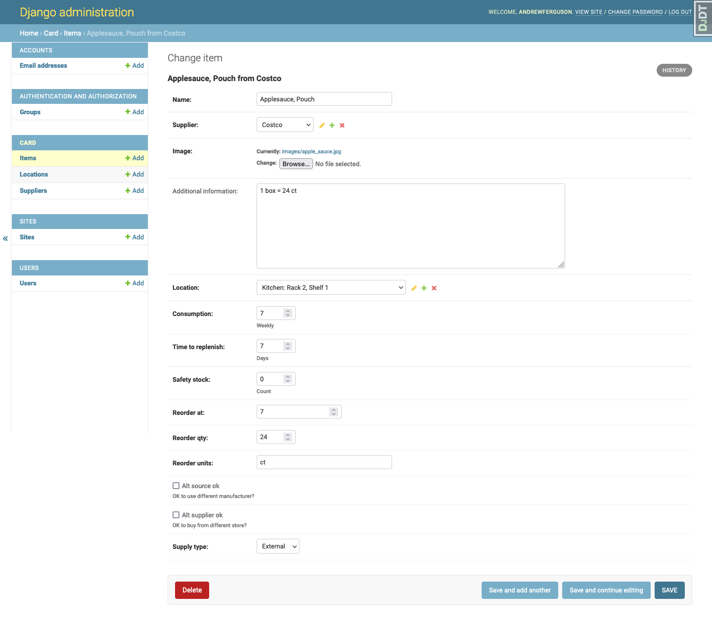
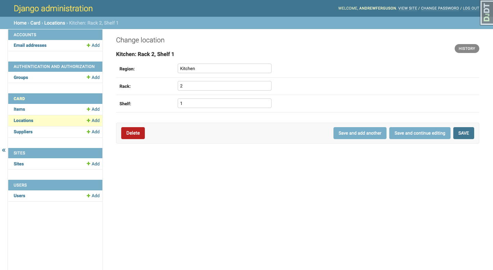
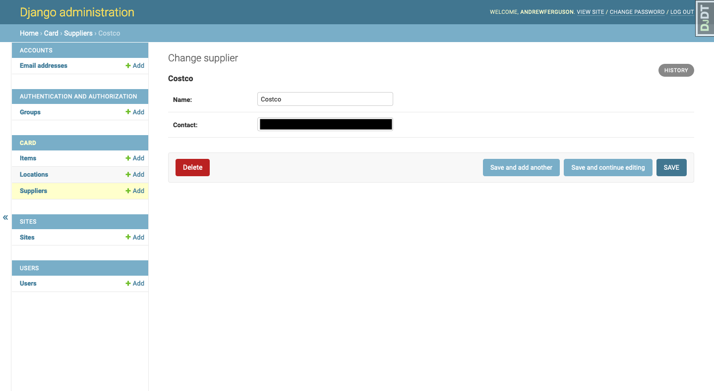

Kanban Household Supply Card Generator
======================================

Background
------------------
I was watching a video on using `Kanban for your pantry <https://www.youtube.com/watch?v=MC7cRwiAmAI>`_ and thought it was a great idea.

There's a couple more videos you can watch as well:

#. `Kanban Pantry 2 <https://www.youtube.com/watch?v=EKwCCOBVM7Y>`_
#. `Kanban @ Home <https://www.youtube.com/watch?v=j9Xs0h0f0rM&t=14s>`_

I couldn't find a tool that would let me easily create the cards I thought I needed, so I made one.

What it is
---------------------
This tool lets you create Kanban supply cards (and labels) for your home. Items are generated as a PDF so you can easily print them. Cards print on standard 3x5 cards. Labels print on an 8.5x11 sheet that you can cutout.

Designed to run on localhost for now. Very much alpha, but it works and we use it at home.

Add items/suppliers/locations: ``http://localhost:8000/admin/``

Generate all cards: ``http://localhost:8000/generate/card/``

Generate an individual card: ``http://localhost:8000//generate/card/<id>/``

Generate shelf labels: ``http://localhost:8000//generate/shelf/``

.. image:: https://img.shields.io/badge/built%20with-Cookiecutter%20Django-ff69b4.svg?logo=cookiecutter
     :target: https://github.com/cookiecutter/cookiecutter-django/
     :alt: Built with Cookiecutter Django
.. image:: https://img.shields.io/badge/code%20style-black-000000.svg
     :target: https://github.com/ambv/black
     :alt: Black code style

:License: Affero GPLv3

Examples
--------

Kanban Supply Card Example
^^^^^^^^^^^^^^^^^^^^^^^^^^
.. image:: docs/images/labels_card_example.png
    :alt: Example Kanban Card

Kanban Supply Card Example
^^^^^^^^^^^^^^^^^^^^^^^^^^
.. image:: docs/images/labels_shelf_example.png
    :alt: Example of shelf labels

Adding an Item
^^^^^^^^^^^^^^

Adding a Location
^^^^^^^^^^^^^^^^^

Adding a Supplier
^^^^^^^^^^^^^^^^^

Settings
--------

Moved to settings_.

.. _settings: http://cookiecutter-django.readthedocs.io/en/latest/settings.html

Basic Commands
--------------

Setting Up Your Users
^^^^^^^^^^^^^^^^^^^^^

* To create a **normal user account**, just go to Sign Up and fill out the form. Once you submit it, you'll see a "Verify Your E-mail Address" page. Go to your console to see a simulated email verification message. Copy the link into your browser. Now the user's email should be verified and ready to go.

* To create an **superuser account**, use this command::

    $ python manage.py createsuperuser

For convenience, you can keep your normal user logged in on Chrome and your superuser logged in on Firefox (or similar), so that you can see how the site behaves for both kinds of users.

Type checks
^^^^^^^^^^^

Running type checks with mypy:

::

  $ mypy kanban_household_supply_card_generator

Test coverage
^^^^^^^^^^^^^

To run the tests, check your test coverage, and generate an HTML coverage report::

    $ coverage run -m pytest
    $ coverage html
    $ open htmlcov/index.html

Running tests with py.test
~~~~~~~~~~~~~~~~~~~~~~~~~~

::

  $ pytest

Live reloading and Sass CSS compilation
^^^^^^^^^^^^^^^^^^^^^^^^^^^^^^^^^^^^^^^

Moved to `Live reloading and SASS compilation`_.

.. _`Live reloading and SASS compilation`: http://cookiecutter-django.readthedocs.io/en/latest/live-reloading-and-sass-compilation.html

Deployment
----------

The following details how to deploy this application.

